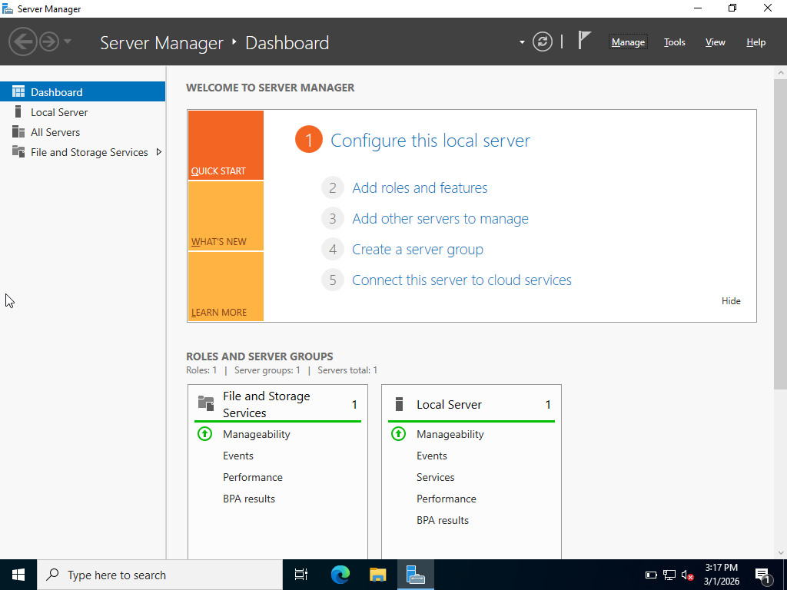
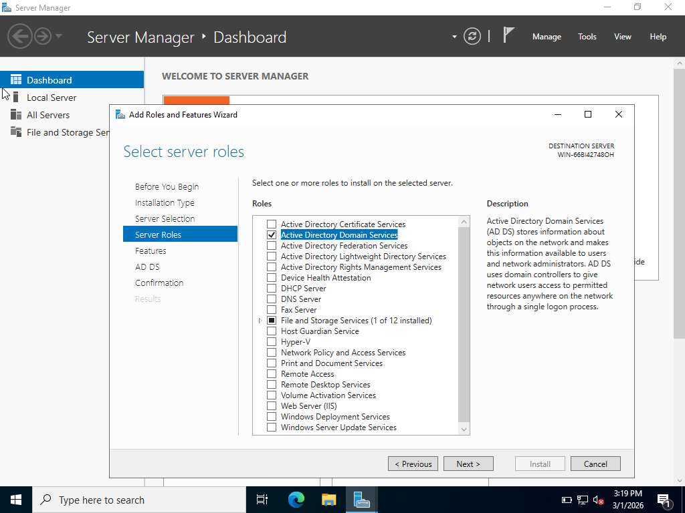
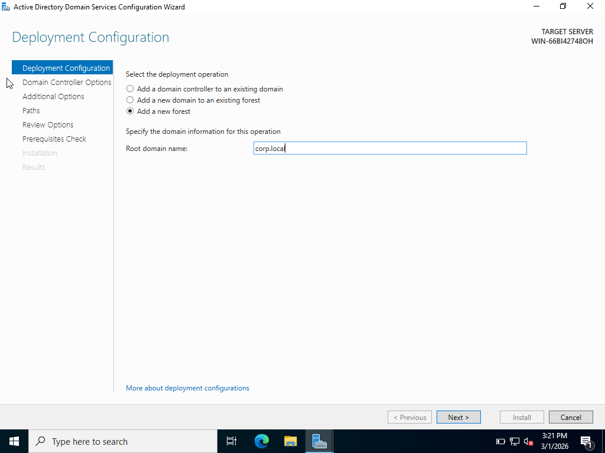
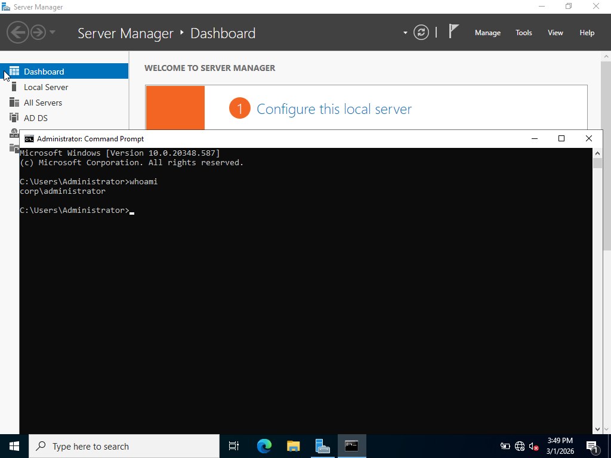
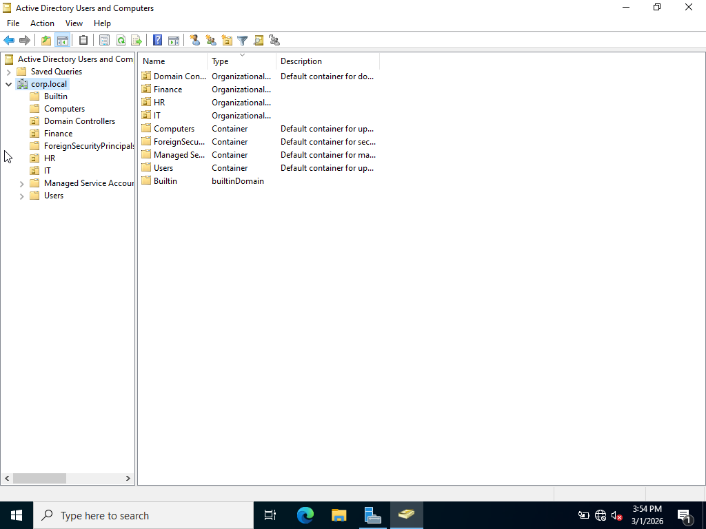
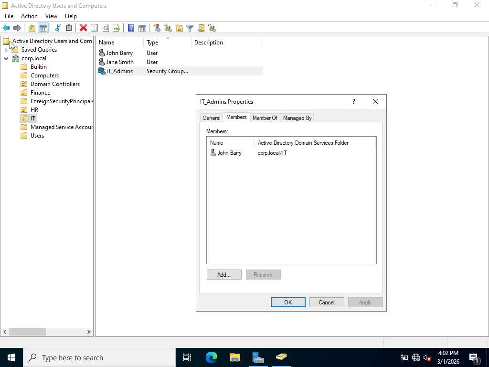
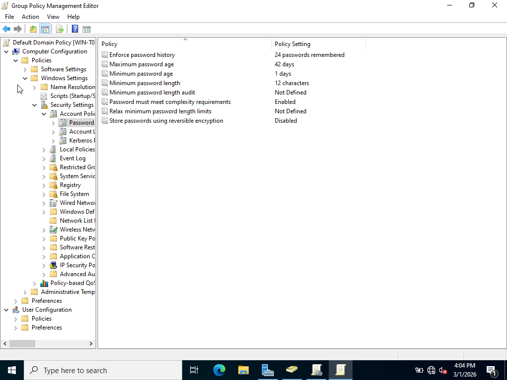
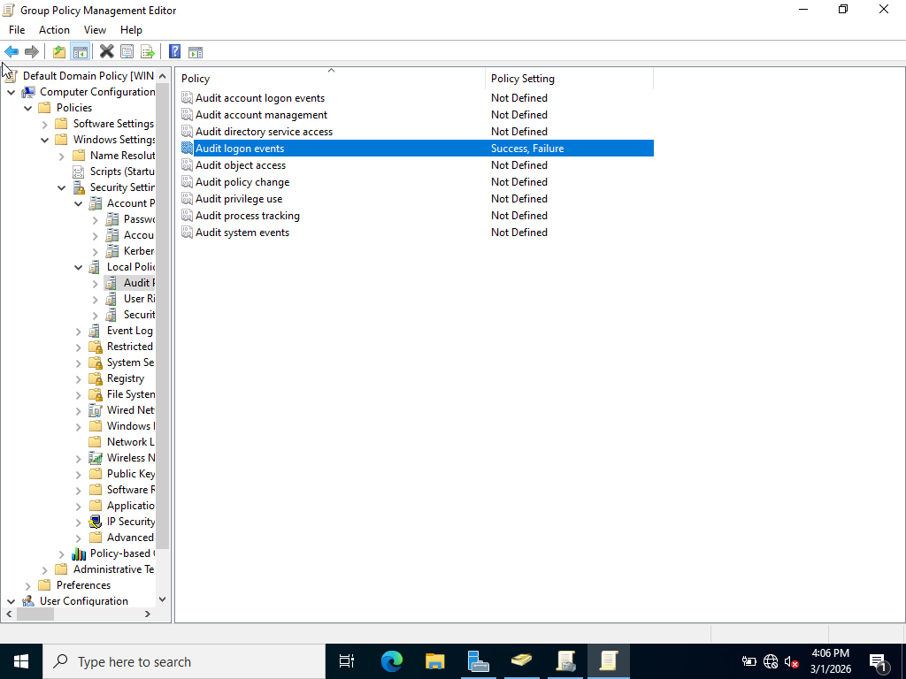
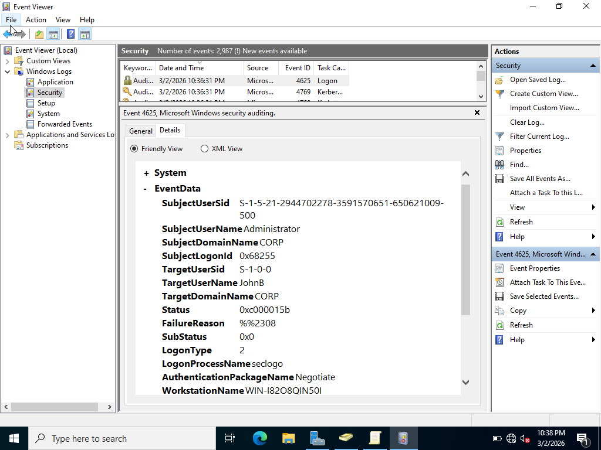
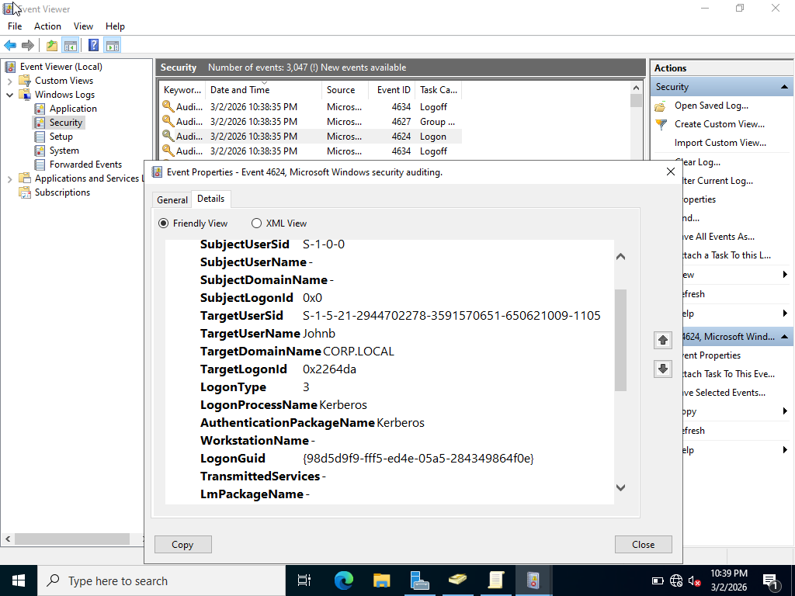

# Active-Directory-Home-Lab
# Overview
This project demonstrates setting up a Windows Server Active Directory lab in a virtual environment.

The lab covers:

- Windows Server Installation
- Active Directory Domain Services setup
- Domain Controller creation
- Domain Admin login
- Organizational Units (OUs) creation
- User creation
- Group membership configuration
- Password policy configuration
- Audit policy configuration
- Security event log monitoring
- Simulated failed and successful logins

# Lab Architecture

Domain Controller:
- Windows Server 2022
- Static IP: 192.168.50.10
- Domain: corp.local

Client Machine:
- Windows 11 Pro
- Joined to corp.local

# Step-by-Step Screenshots

1. Server Installed

2. Active Directory Role Installed

3. Domain Created

4. Domain Admin Login

5. Organizational Units Created

6. Users Created

7. Group Membership Configured

8. Password Policy Set

9. Audit Enabled

10. Failed Login Attempt

11. Successful Login

# Security Event IDs Observed
- 4624 - Successful Login
- 4625 - Failed Login
- 4723 - Password Change Attempt
- 4724 - Password Reset

# Skills Demonstrated
- Windows Server Administration
- Active Directory Administration
- Organizational Unit (OU) Creation
- User and Group Management
- Password Policy Configuration
- Audit Policy Setup
- Security Event Monitoring
- Domain Enivronment Troubleshooting

